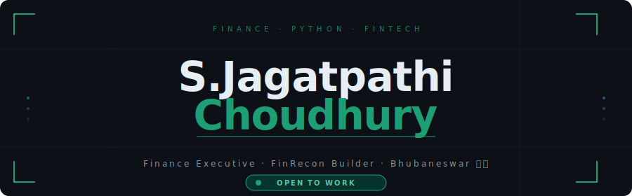

<div align="center">

</div>

<br>

<div align="center">

[](https://www.linkedin.com/in/s-jagatpathi-choudhury)
[](https://github.com/sjchoudhury)
[](mailto:your@email.com)

</div>

---

```python
profile = {
    "role"   : "Finance Executive @ KoinX (Simplify Infotech)",
    "exp"    : "~2.5y  |  R2R · GL Accounting · GST/TDS · SAP FI/CO",
    "builds" : "FinRecon — Multi-module Reconciliation SaaS",
    "stack"  : ["Python", "FastAPI", "SQLite", "Docker", "Railway"],
    "base"   : "Bhubaneswar, Odisha, India",
    "open"   : True,
}
```

---

### `▸ skills`

**Finance & Accounts**
`GST/TDS` &nbsp; `SAP FI/CO` &nbsp; `Record to Report` &nbsp; `GL Accounting` &nbsp; `MIS Reporting`

**Tech**
`Python` &nbsp; `FastAPI` &nbsp; `Docker` &nbsp; `SQLite` &nbsp; `Git` &nbsp; `REST APIs`

---

### `▸ featured build`

```
⬡ FinRecon — Financial Reconciliation SaaS
━━━━━━━━━━━━━━━━━━━━━━━━━━━━━━━━━━━━━━━━━━━━━━━━━━━━━
  ├── Bank Recon      →  6-pass matching engine
  ├── GST IMS         →  Input tax reconciliation
  └── Pay Gateway     →  Razorpay · PhonePe · Cashfree · Stripe

  Stack : Python · FastAPI · SQLite · Docker · Railway
  Status: LIVE ⬤
```

[](https://github.com/sjchoudhury/Reconciliation-Tool)

---

### `▸ stats`

<div align="center">

&nbsp;

</div>

<div align="center">

</div>

---

<div align="center">

`// where finance meets code`

</div>
